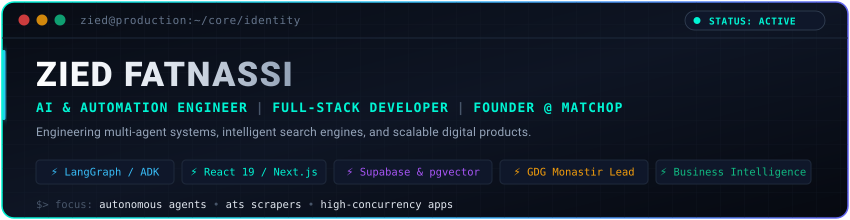
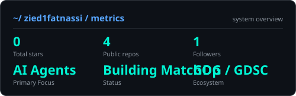
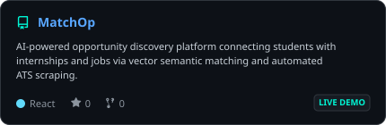
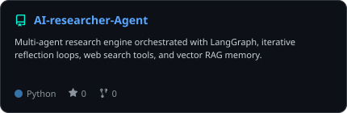
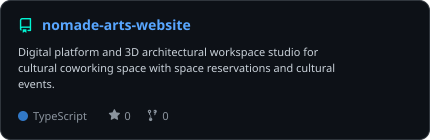
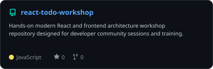

<div align="center">

<!-- HERO BANNER -->


<br><br>

<!-- ANIMATED TYPING SUBHEADER -->
<a href="https://github.com/zied1fatnassi">
  
</a>

<br>

<!-- QUICK ACTION LINKS & STATUS -->
<a href="https://matchop.tech/"></a>
<a href="https://linkedin.com/in/zied-fatnassi"></a>
<a href="mailto:fatnassizied@fsegma.u-monastir.tn"></a>
<a href="https://developers.google.com/community/gdg"></a>
<a href="https://github.com/zied1fatnassi"></a>

<br><br>


</div>

---

## `~/` whoami

```console
$ cat about.txt
```

I'm **Zied Fatnassi**, an AI & Automation Engineer, Full-Stack Developer, and Founder based in Monastir, Tunisia. I engineer production-grade AI agents, intelligent matching platforms, automated data pipelines, and scalable web software.

- 🤖 **AI & Autonomous Agents:** Building multi-agent systems and automated reasoning pipelines using **LangGraph**, **LangChain**, **Google ADK**, **MCP (Model Context Protocol)**, **A2A**, and **Groq**. Architecting autonomous agents with self-reflection loops, tool-calling chains, and vector memory (**ChromaDB**, **pgvector**).
- 🚀 **Founder & Product Engineering:** Co-Founder & CEO of **[MatchOp](https://matchop.tech/)**, an AI-driven vertical opportunity discovery platform. Engineered semantic vector matching algorithms, automated ATS job aggregation pipelines (Scrapling + Groq), real-time messaging, and high-concurrency student-company workflows.
- ⚡ **Full-Stack Systems:** Architecting modern responsive web applications using **React 19**, **Next.js**, **TypeScript**, **Node.js**, and **Supabase (PostgreSQL, Realtime, Storage, Edge Functions)**, supported by automated testing with **Playwright** and **Vitest**.
- 📊 **Data & Business Intelligence:** Business computing background focusing on data analytics, **Power BI** dashboards, automated ETL/scraping pipelines, SQL optimization, and predictive enterprise intelligence.
- 🌐 **Developer Community Leadership:** Organizer at **GDG Monastir**, Lead at **Google Developer Student Clubs (GDSC ISIMA)**, and **Gemini Certified Educator**. Leading workshops and bootcamps on AI agents, modern frontend stacks, and software architecture.

<br>

---

<div align="center">

## `~/` toolbox

<!-- Curated Tech Icons -->


</div>

<br>

| Domain | Verified Stack &amp; Technologies |
|---|---|
| **AI &amp; Agentic Systems** | `LangGraph` `LangChain` `Google ADK` `Model Context Protocol (MCP)` `A2A` `Gemini` `Groq` `ChromaDB` `HuggingFace` `Vector RAG` |
| **Frontend Engineering** | `React 19` `Next.js` `TypeScript` `JavaScript (ESNext)` `Vite` `Tailwind CSS` `Three.js` `Framer Motion` `HTML5 / CSS3` |
| **Backend &amp; Database** | `Node.js` `Supabase` `PostgreSQL` `pgvector` `REST APIs` `Supabase Edge Functions` `Java` `Symfony (PHP)` |
| **Data &amp; Automation** | `Power BI` `Python (Pandas, BeautifulSoup)` `Scrapling` `SQL` `Web Scraping Pipelines` `ETL Workflows` |
| **DevOps &amp; Testing** | `Docker` `Git` `GitHub Actions (CI/CD)` `Playwright` `Vitest` `Vercel` `VS Code` |

<br>

---

<div align="center">

## `~/` capabilities &amp; stack radar

<!-- Side-by-side SVG Radars (Self-Assessed Capabilities vs Repository Language Mix) -->
<table>
<tr>
<td width="50%" align="center" valign="middle">

**Domain Capabilities (Self-Assessed)**
<picture>
  <source media="(prefers-color-scheme: dark)" srcset="assets/radar-dark.svg">
  <source media="(prefers-color-scheme: light)" srcset="assets/radar-light.svg">
  
</picture>

</td>
<td width="50%" align="center" valign="middle">

**Language &amp; Stack Mix (Repository-Derived)**
<picture>
  <source media="(prefers-color-scheme: dark)" srcset="assets/radar-langs-dark.svg">
  <source media="(prefers-color-scheme: light)" srcset="assets/radar-langs-light.svg">
  
</picture>

</td>
</tr>
</table>

</div>

---

<div align="center">

## `~/` telemetry &amp; metrics

<!-- Generated Dynamic Stats Card -->
<picture>
  <source media="(prefers-color-scheme: dark)" srcset="assets/card-stats-dark.svg">
  <source media="(prefers-color-scheme: light)" srcset="assets/card-stats-light.svg">
  
</picture>

<br><br>

<!-- GitHub Contribution Streak -->


</div>

---

<div align="center">

## `~/` selected work

<!-- 2x2 Responsive SVG Project Cards -->
<table>
<tr>
<td width="50%">
  <a href="https://matchop.tech/">
    <picture>
      <source media="(prefers-color-scheme: dark)" srcset="assets/card-MATCHOP-dark.svg">
      <source media="(prefers-color-scheme: light)" srcset="assets/card-MATCHOP-light.svg">
      
    </picture>
  </a>
</td>
<td width="50%">
  <a href="https://github.com/zied1fatnassi/AI-researcher-Agent">
    <picture>
      <source media="(prefers-color-scheme: dark)" srcset="assets/card-AI-researcher-Agent-dark.svg">
      <source media="(prefers-color-scheme: light)" srcset="assets/card-AI-researcher-Agent-light.svg">
      
    </picture>
  </a>
</td>
</tr>
<tr>
<td width="50%">
  <a href="https://github.com/zied1fatnassi/nomade-arts-website">
    <picture>
      <source media="(prefers-color-scheme: dark)" srcset="assets/card-nomade-arts-website-dark.svg">
      <source media="(prefers-color-scheme: light)" srcset="assets/card-nomade-arts-website-light.svg">
      
    </picture>
  </a>
</td>
<td width="50%">
  <a href="https://github.com/zied1fatnassi/react-todo-workshop">
    <picture>
      <source media="(prefers-color-scheme: dark)" srcset="assets/card-react-todo-workshop-dark.svg">
      <source media="(prefers-color-scheme: light)" srcset="assets/card-react-todo-workshop-light.svg">
      
    </picture>
  </a>
</td>
</tr>
</table>

<br>

<!-- Project Index Table -->
| Project | Role &amp; Focus | Tech Stack | Links |
|:---|:---|:---|:---:|
| **[MatchOp](https://github.com/zied1fatnassi/MATCHOP)** | **Co-Founder &amp; CEO** • AI Opportunity Discovery Platform | `React 19` `Supabase` `pgvector` `Python` `Vite` | [🌐 Live Platform](https://matchop.tech/) • [Source](https://github.com/zied1fatnassi/MATCHOP) |
| **[AI-researcher-Agent](https://github.com/zied1fatnassi/AI-researcher-Agent)** | **Creator** • Autonomous Multi-Agent Deep Research System | `Python` `LangGraph` `Groq` `ChromaDB` `Tavily` | [Source](https://github.com/zied1fatnassi/AI-researcher-Agent) • [Workshop](https://developers.google.com/community/gdg) |
| **[Nomade Art Platform](https://github.com/zied1fatnassi/nomade-arts-website)** | **Lead Developer** • Cultural Hub Platform &amp; 3D Studio | `React` `TypeScript` `Three.js` `Tailwind` `Vite` | [Source](https://github.com/zied1fatnassi/nomade-arts-website) |
| **[Association Apollon](https://github.com/zied1fatnassi)** | **Full-Stack Developer** • Digital Community Hub | `React` `Node.js` `PostgreSQL` `REST APIs` | [Active Platform](https://github.com/zied1fatnassi) |
| **[GDG / GDSC Workshops](https://github.com/zied1fatnassi/react-todo-workshop)** | **Instructor &amp; Lead** • Hands-on Engineering Labs | `React` `JavaScript` `Modern Web` | [Source](https://github.com/zied1fatnassi/react-todo-workshop) |

</div>

---

## `~/` leadership &amp; community

```console
$ ./list_initiatives.sh --verified
```

- 🌍 **Organizer @ Google Developer Groups (GDG Monastir):** Curating technical conferences, DevFests, and hands-on workshops on Agentic AI, Cloud technologies, and full-stack development.
- 🎓 **Lead @ Google Developer Student Clubs (GDSC ISIMA):** Mentoring student engineers, hosting software architecture sessions, and building community-driven open source tools.
- 🌟 **Gemini Certified Educator:** Training developers and educators on generative AI, prompt engineering workflows, and practical multimodal applications.

<br>

---

<div align="center">

```console
$ zied --status "shipping autonomous agents & high-impact software" --location "monastir, tunisia"
```

<sub>`01011010 01001001 01000101 01000100 00100000 01000110 01000001 01010100 01001110 01000001 01010011 01010011 01011001`</sub>

<br>

<sub>Crafted with code, SVG automation, and genuine engineering.</sub>

</div>
